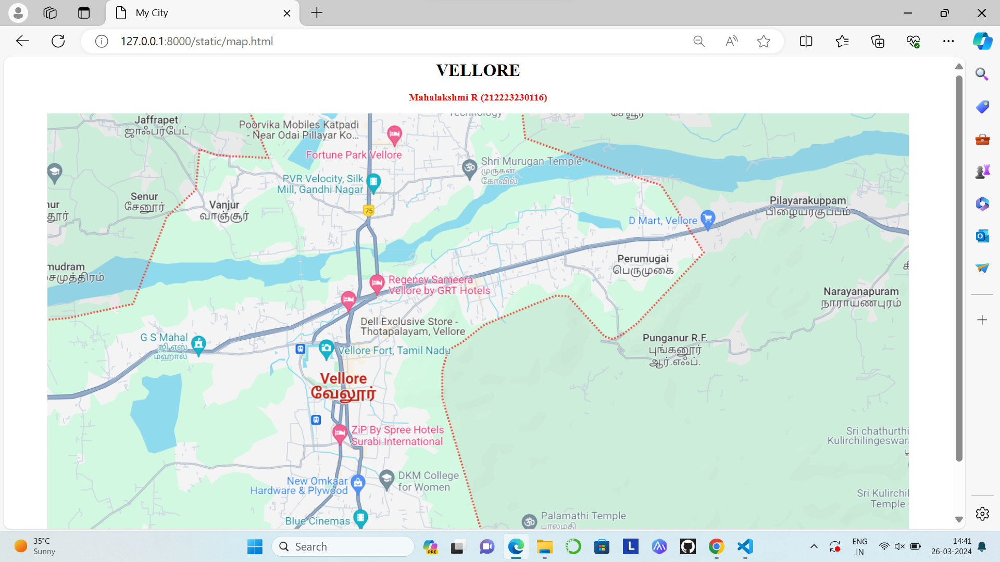
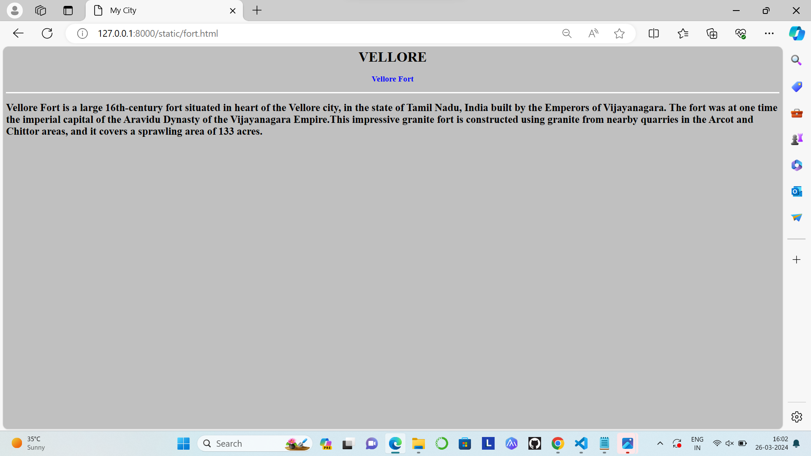
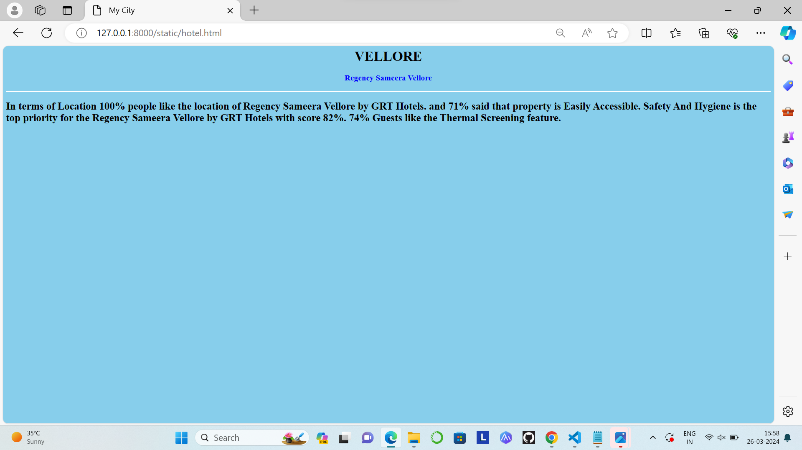
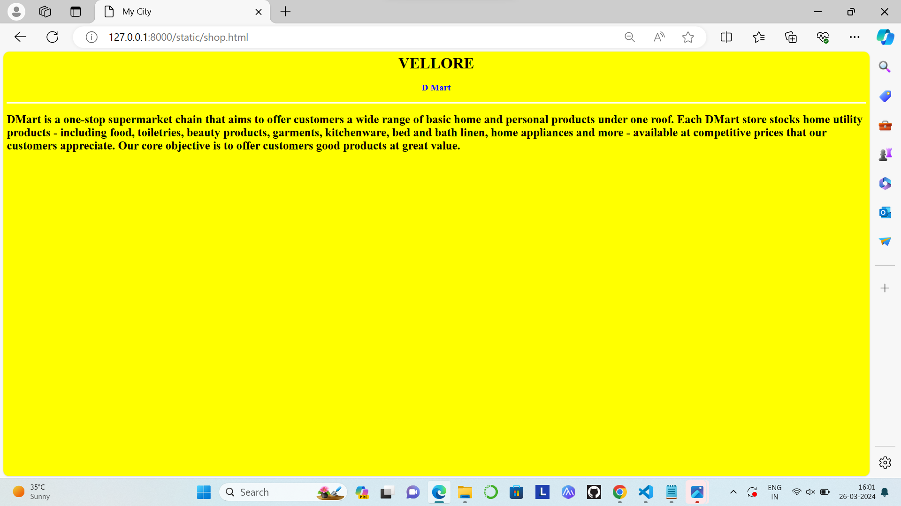
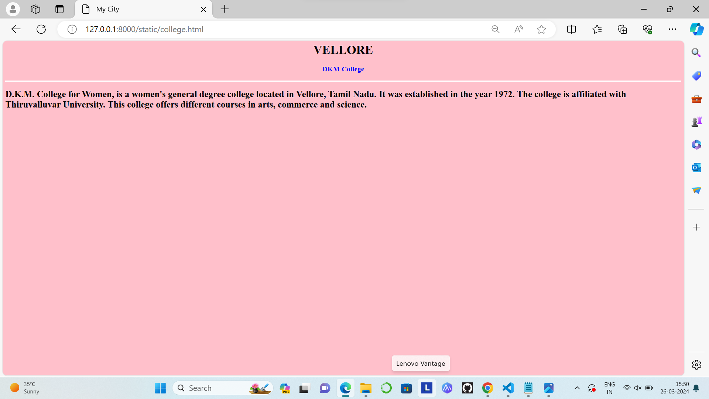
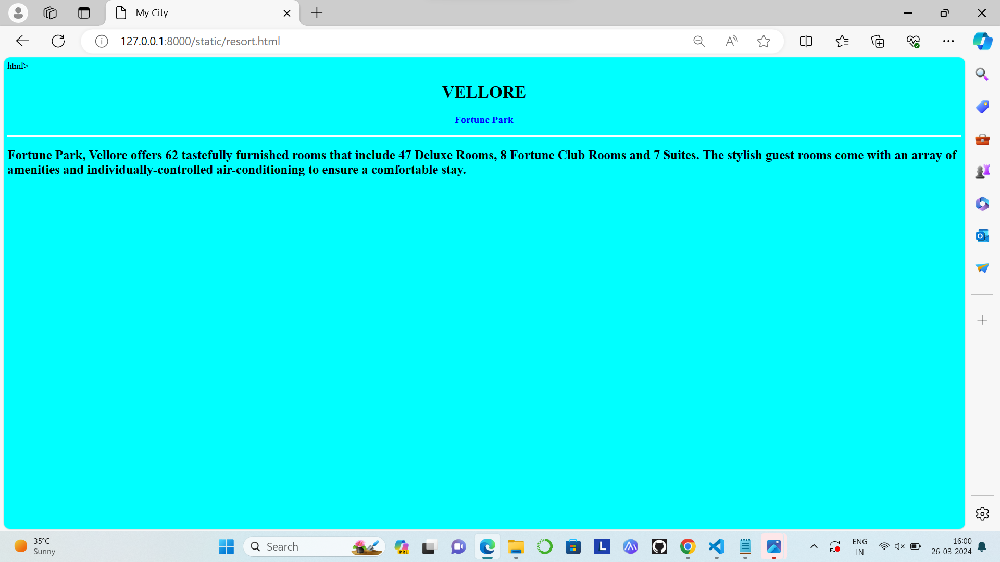

# Ex04 Places Around Me
## Date: 21/3/23

## AIM
To develop a website to display details about the places around my house.

## DESIGN STEPS

### STEP 1
Create a Django admin interface.

### STEP 2
Download your city map from Google.

### STEP 3
Using ```<map>``` tag name the map.

### STEP 4
Create clickable regions in the image using ```<area>``` tag.

### STEP 5
Write HTML programs for all the regions identified.

### STEP 6
Execute the programs and publish them.

## CODE
```
map.html

<html>
    <head>
        <title>My City</title>
    </head>
    <body>
    <h1 align="center">
        <font color="black"><b>VELLORE</b></font>
    </h1>
    <h3 align="center">
        <font color="red"><b>Mahalakshmi R (212223230116)</b></font>
    </h3>  
    <center>
        

<map name="image-map">
    <area target="" alt="Vellore Fort" title="Vellore Fort" href="fort.html" coords="535,424,762,467" shape="rect">
    <area target="" alt="Regency Sameera Hotel" title="Regency Sameera Hotel" href="hotel.html" coords="592,292,842,352" shape="rect">
    <area target="" alt="D Mart" title="D Mart" href="shop.html" coords="1067,172,1265,227" shape="rect">
    <area target="" alt="DKM College" title="DKM College" href="college.html" coords="612,652,793,717" shape="rect">
    <area target="" alt="Fortune Park" title="Fortune Park" href="resort.html" coords="461,49,676,102" shape="rect">
</map>
    </center> 
    </body>
</html>

fort.html

<html>
    <head>
        <title>My City</title>
    </head>
    <body bgcolor="silver">
        <h1 align="center">
            <font color="black"><b>VELLORE</b></font>
        </h1>
        <h3 align="center">
        <font color="blue"><b>Vellore Fort</b></font>
        </h3>
        <hr size="3" color="white">
        <p align="justify">
            <font face="Georgia" size="5"></font>
            <h2>
            Vellore Fort is a large 16th-century fort situated in heart of the Vellore city, in the state of Tamil Nadu, India built by the Emperors of Vijayanagara. The fort was at one time the imperial capital of the Aravidu Dynasty of the Vijayanagara Empire.This impressive granite fort is constructed using granite from nearby quarries in the Arcot and Chittor areas, and it covers a sprawling area of 133 acres.
            </h2>
        </p>
    </body>
</html>

hotel.html

<html>
    <head>
        <title>My City</title>
    </head>
    <body bgcolor="skyblue">
        <h1 align="center">
            <font color="black"><b>VELLORE</b></font>
        </h1>
        <h3 align="center">
        <font color="blue"><b>Regency Sameera Vellore</b></font>
        </h3>
        <hr size="3" color="white">
        <p align="justify">
            <font face="Georgia" size="15"></font>
            <h2>
                In terms of Location 100% people like the location of Regency Sameera Vellore by GRT Hotels. and 71% said that property is Easily Accessible. Safety And Hygiene is the top priority for the Regency Sameera Vellore by GRT Hotels with score 82%. 74% Guests like the Thermal Screening feature.
            </h2>
        </p>
    </body>
</html>

shop.html

<html>
    <head>
        <title>My City</title>
    </head>
    <body bgcolor="yellow">
        <h1 align="center">
            <font color="black"><b>VELLORE</b></font>
        </h1>
        <h3 align="center">
        <font color="blue"><b>D Mart</b></font>
        </h3>
        <hr size="3" color="white">
        <p align="justify">
            <font face="Georgia" size="8"></font>
            <h2>
            DMart is a one-stop supermarket chain that aims to offer customers a wide range of basic home and personal products under one roof. Each DMart store stocks home utility products - including food, toiletries, beauty products, garments, kitchenware, bed and bath linen, home appliances and more - available at competitive prices that our customers appreciate. Our core objective is to offer customers good products at great value.
            </h2>
        </p>
    </body>
</html>

college.html

<html>
    <head>
        <title>My City</title>
    </head>
    <body bgcolor="pink">
        <h1 align="center">
            <font color="black"><b>VELLORE</b></font>
        </h1>
        <h3 align="center">
        <font color="blue"><b>DKM College</b></font>
        </h3>
        <hr size="3" color="white">
        <p align="justify">
            <font face="Georgia" size="15"></font>
            <h2>
            D.K.M. College for Women, is a women's general degree college located in Vellore, Tamil Nadu. It was established in the year 1972. The college is affiliated with Thiruvalluvar University. This college offers different courses in arts, commerce and science.
            </h2>
        </p>
    </body>
</html>

resort.html

<html>
    <head>
        <title>My City</title>
    </head>
    <body bgcolor="cyan">
        <h1 align="center">
            <font color="black"><b>VELLORE</b></font>
        </h1>
        <h3 align="center">
        <font color="blue"><b>Fortune Park</b></font>
        </h3>
        <hr size="3" color="white">
        <p align="justify">
            <font face="Georgia" size="5"></font>
            <h2>
                Fortune Park, Vellore offers 62 tastefully furnished rooms that include 47 Deluxe Rooms, 8 Fortune Club Rooms and 7 Suites. The stylish guest rooms come with an array of amenities and individually-controlled air-conditioning to ensure a comfortable stay.
            </h2>
        </p>
    </body>
</html>
```

## OUTPUT







## RESULT
The program for implementing image maps using HTML is executed successfully.
